# AI Chatbot Starter


This AI Chatbot Starter is designed to help developers find the information they need to debug their issues.

It should answer customer questions about the products or services specified.

[](https://gitpod.io/#https://github.com/Anant/ai-chatbot-starter)

## Getting Started

1. Clone the repository
2. Make sure you have Python 3.11 installed
3. Get required Astra credentials from Anant
4. Get Langflow id and flow id from Astra langflow

Now follow the steps below to get the chatbot up and running.

### Configuring the ChatBot

Documentation (provided as a list of web urls in the `config.yml`) can be ingested into your Astra DB Collection. Follow these steps:

1. Install the requirements using the following command:

    ```bash
    pip install -r requirements.txt
    pip uninstall openai # if fails use sudo pip uninstall openai
    pip install openai==0.28
    ```

2. Obtain your OpenAI API Key from the OpenAI Settings page.
3. Create a `config.yml` file with the values required. Here you specify both the list of pages to scrape, as well as the list of rules for your chatbot to observe. For an example of how this can look, take a look at either `config.yml.example_datastax`, or `config.yml.example_pokemon`.
4. Create a `.env` file & add the required information. Add the OpenAI Key from Step 1 as the value of `OPENAI_API_KEY`. The Astra and OpenAI env variables are required, while the others are only needed if the respective integrations are enabled. For an example of how this can look, take a look at `.env_example`.
5. From the root of the repository, run the following command. This will scrape the pages specified in the `config.yml` file into text files within the `output` folder of your `ai-chatbot-starter` directory.

    ```bash
    PYTHONPATH=. python data/scrape_site.py
    ```

6. From the root of the repository, run the following command. This will store the embeddings for the scraped text in your AstraDB instance.

    ```bash
    pip install --upgrade openai
    PYTHONPATH=. python data/compile_documents.py
    ```

7. From the root of the repository, run the following command. Process requires, Playlist.yaml as input and looks like below

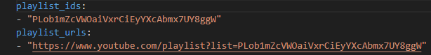

This will get video ids using playlist ids or play list url's specified in the `playlist_ids.yaml`. These video ids will be appended to `video_ids.yaml` file present under `ai-chatbot-starter` directory.

```bash
    pip uninstall openai # if fails use sudo pip uninstall openai
    pip install openai==0.28
    PYTHONPATH=. python data/playlist.py
```

8. From the root of the repository, run the following command. Process require video_ids.yaml as input and looks like below.

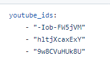

This will scrape videos specified in the `video_ids.yaml` file into text files within the `video_output` folder of your `ai-chatbot-starter` directory.

```bash
    pip uninstall openai # if fails use sudo pip uninstall openai
    pip install openai==0.28
    PYTHONPATH=. python data/scrape_videos.py
```

9. From the root of the repository, run the following command. This will store the embeddings for the scraped videos to your AstraDB instance.

```bash
    pip install --upgrade openai
    PYTHONPATH=. python data/compile_documents.py "video_output"
```

10. Load Products / Ecommerce data. Update config.yml file with sites from which data to be loaded. Below is the look and feel of product section in configuration file.


From the root of the repository, run the below commands. This will crawal through all urls specified under "products" and save in `ecommerce_sites` folder under `ai-chatbot-starter` directory.

```bash
    pip uninstall openai # if fails use sudo pip uninstall openai
    pip install openai==0.28
    PYTHONPATH=. python data/ecommerce_crawler_generic.py
```
11. Update .env file to configure table name in which product information to be stored.
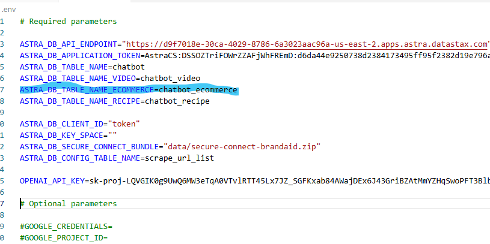


From the root of the repository, run the below commands. This will store the embeddings for the product information to your AstraDB instance.

```bash
    pip install --upgrade openai
    PYTHONPATH=. python data/compile_documents.py ecommerce_sites
```

12. Load Recipes data. Update config.yml file with sites from which data to be loaded. Below is the look and feel of product section in configuration file.

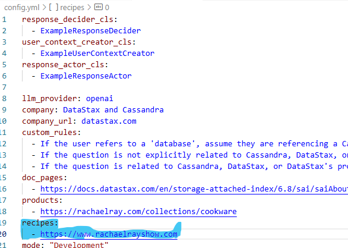

From the root of the repository, run the below commands. This will crawal through all urls specified under "recipes" and save in `recipes_sites` folder under `ai-chatbot-starter` directory.

```bash
    pip uninstall openai # if fails use sudo pip uninstall openai
    pip install openai==0.28
    PYTHONPATH=. python data/recipe_crawler_generic.py
```
13. Update .env file to configure table name in which product information to be stored.


From the root of the repository, run the below commands. This will store the embeddings for the recipe information to your AstraDB instance.

```bash
    pip install --upgrade openai
    PYTHONPATH=. python data/compile_documents.py recipe_sites
```

### Running the ChatBot

#### Using Docker

If you have Docker installed, you can run the app using the following command:

1. Build the docker image using the following command:

    ```bash
    docker build -t docker_aibot --no-cache .
    ```

2. Run the docker image using the following command:

    ```bash
    docker run -p 5555:5555 docker_aibot
    ```

3. You can test an example query by running:

    ```bash
    python scripts/call_assistant.py "<your_query_here>"
    ```

#### Using Local

Alternatively, you can run the app normally using the following steps:

1. Install the requirements using the following command:

    ```bash
    pip install -r requirements.txt
    ```

2. Run the app using the following command:

    ```bash
    uvicorn app:app --host 0.0.0.0 --port 5555 --reload
    ```

3. You can test an example query by running:

    ```bash
    python scripts/call_assistant.py "<your_query_here>"
    ```

4. To run the chainlit front-end:
   ```
   python -m chainlit run chainlit_app.py -w
   ```

#### Using Langflow
1. Login to Astra portal:

    ```bash
    use https://accounts.datastax.com/session-service/v1/login url for login
    ```
    Below would be the landing page after login to astra
    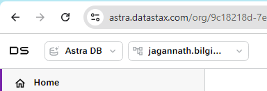

2. Select Langflow from dropdown:


3. Select Langflow that need to be started and click on "Playground". In this case "Vector Store RAG-AI Chat Bot"


4. Chatbot UI would be pop-up.
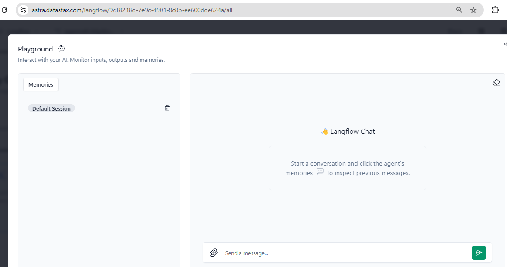

5. Key-in your query in text box below and press "Arrow" button
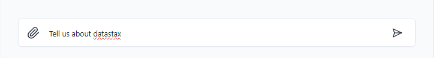

6. Bot responds with asnwer like below
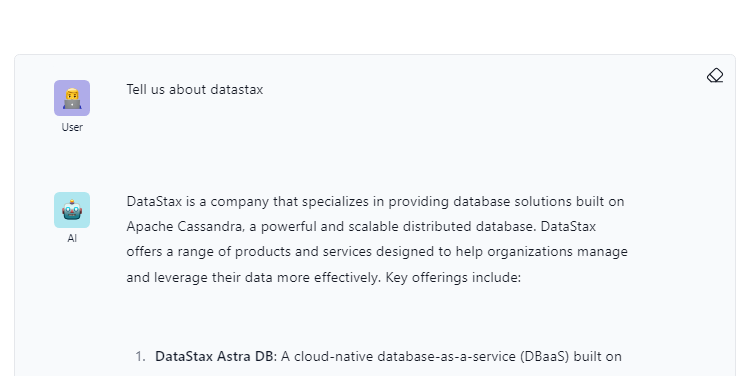

#### BrandAid
1. Login to Astra portal:

    ```bash
    use https://accounts.datastax.com/session-service/v1/login url for login
    ```
    Below would be the landing page after login to astra
    

2. Select Langflow from dropdown:


3. Langflow landing page would be displayed.
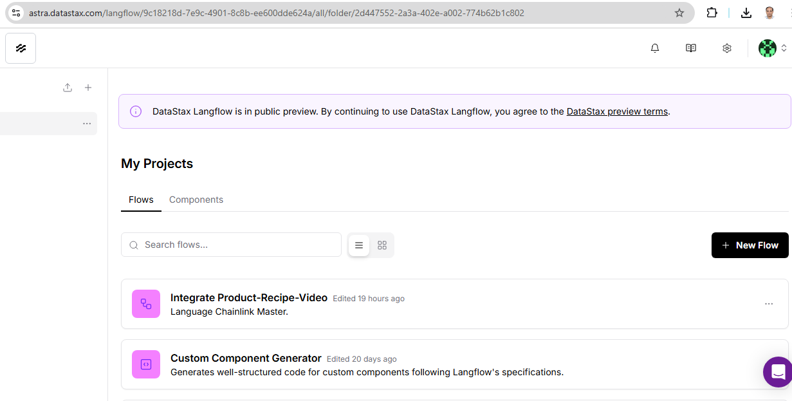

4. Click on "New Flow" button. This would display flow templates
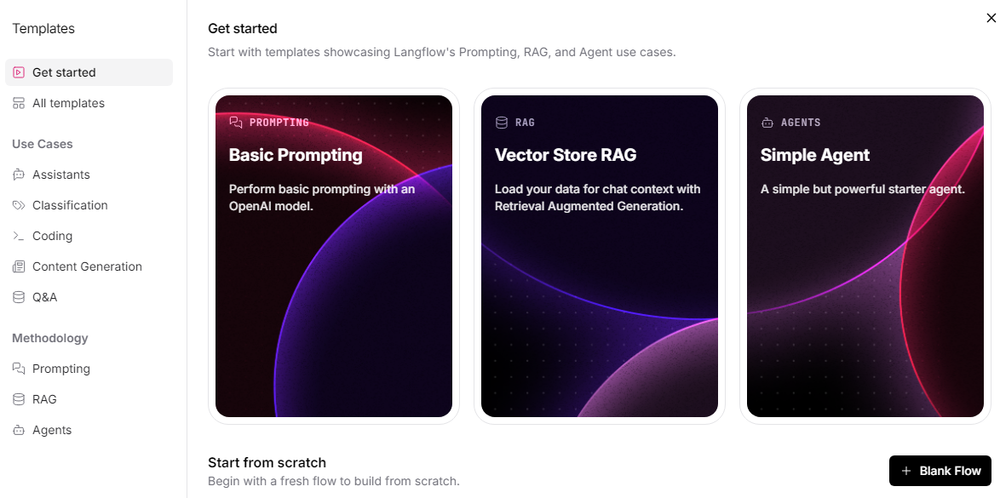

5. Click on "Blank Flow". Blank flow will be displayed as below with title "Untitled document"
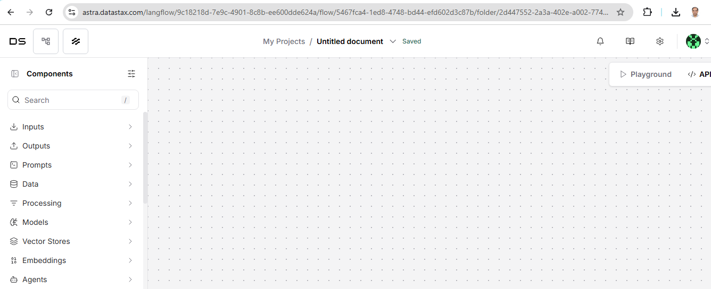

6. Click on \/ button and select import option as shown below. Select "Integrate-Product-Recipe-Video.json" from langflow folder
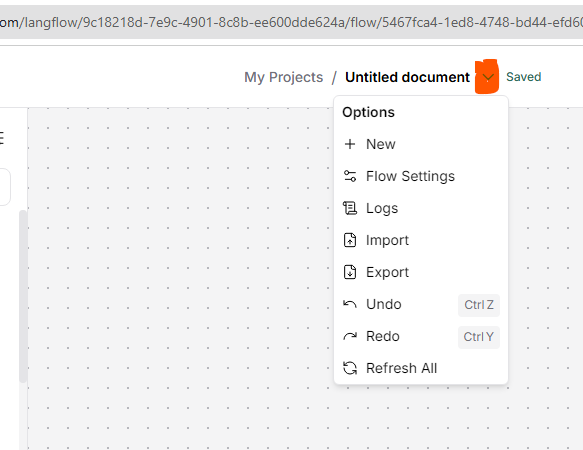

7. Following would be displayed after import. Update title from "Untitled Document" to suitable name.
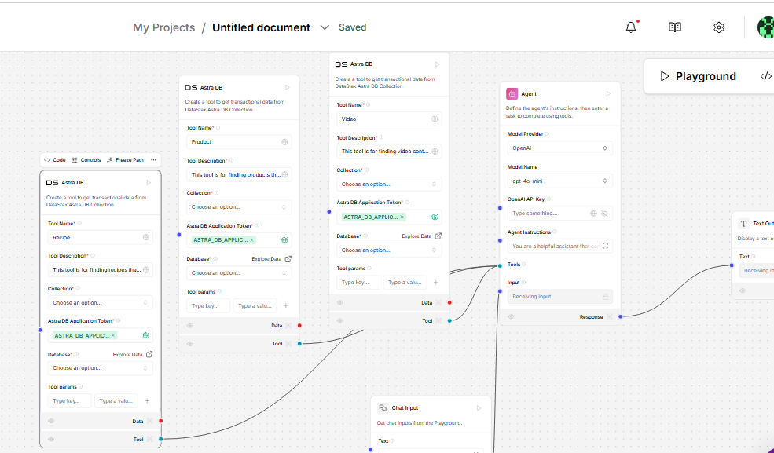

8. Click on api button
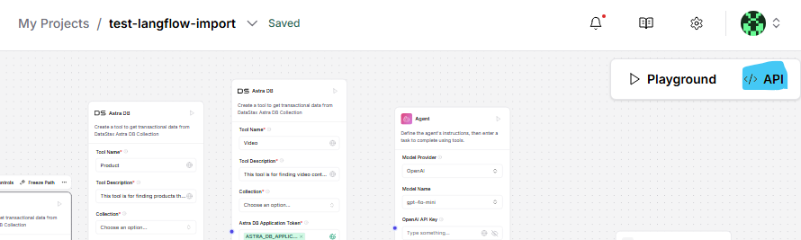

Below screen would be displayed.


Click on "Python API" tab and make a note of below varables.
Langflow_ID, flow_id, and Base_api_Url. Use previously obtained Application_token
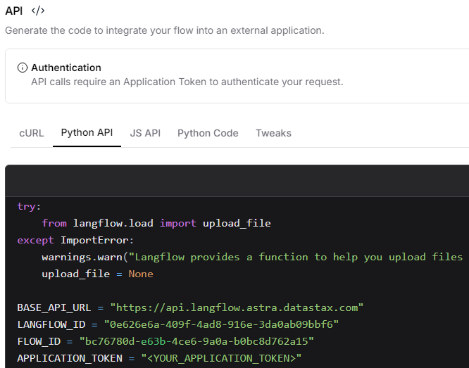

9. From command line, use below git commands to diploy application.
```
git clone repository https://github.com/Anant/ai-chatbot-starter 
cd ai-chatbot-starter
git switch feature/brandaid
cd langflow-chat-ui-chainlit
```
Rename .env_example to .env
Update all variables using the information obtained above/earlier

10. Use below docker-compose command to build and host application locally.
```
docker-compose build
docker-compose up -d
```